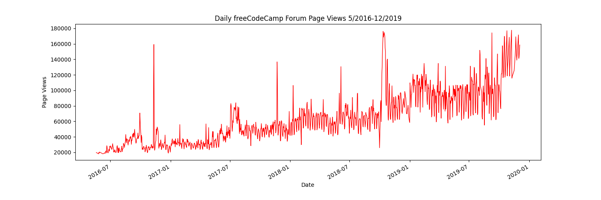
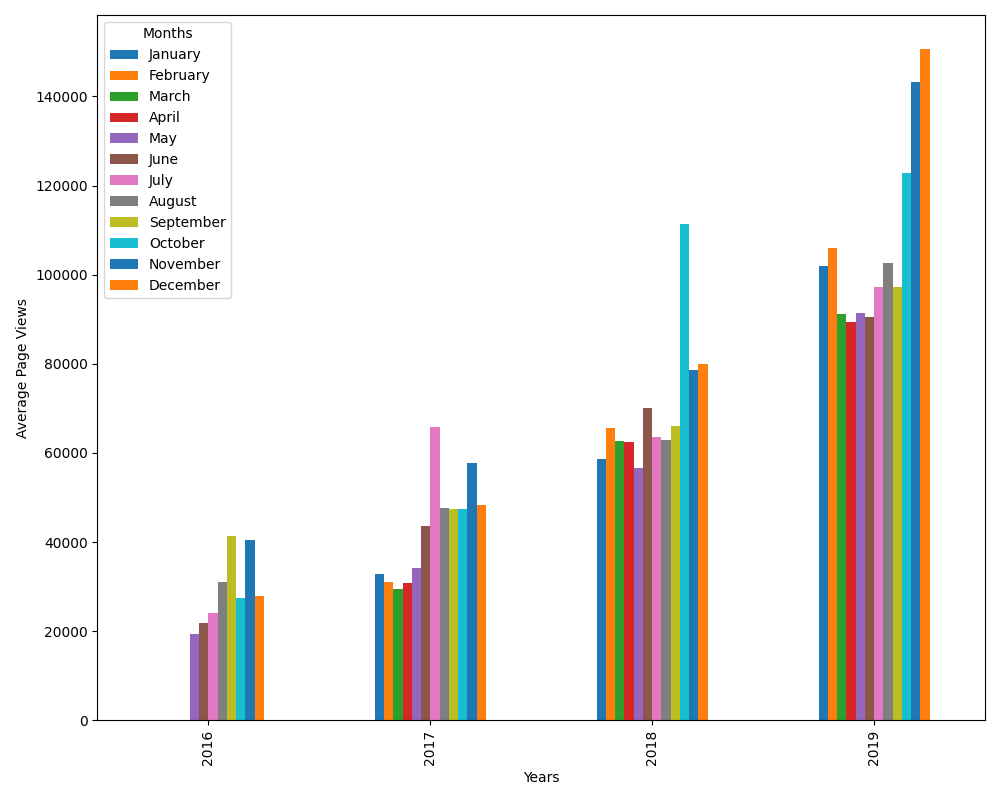
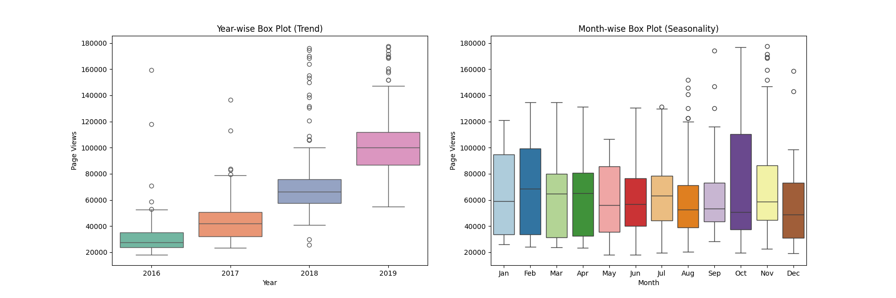

# Page View Time Series Visualizer

This project visualizes time series data of daily page views for the freeCodeCamp forum. It is part of the freeCodeCamp Data Analysis with Python curriculum.

## Project Overview

You will analyze and visualize forum page view data from May 2016 to December 2019. The project generates three types of plots:

### 1. Line Plot
- **File:** `line_plot.png`
- **Description:** Shows the daily freeCodeCamp forum page views over time, highlighting trends and outliers.
- **Example:**
  
  

### 2. Bar Plot
- **File:** `bar_plot.png`
- **Description:** Displays the average daily page views for each month, grouped by year. This helps compare monthly averages across years.
- **Example:**
  
  

### 3. Box Plots
- **File:** `box_plot.png`
- **Description:** Contains two adjacent box plots:
  - **Year-wise Box Plot (Trend):** Shows the distribution of page views for each year, revealing trends and outliers.
  - **Month-wise Box Plot (Seasonality):** Shows the distribution of page views for each month (across all years), highlighting seasonal patterns.
- **Example:**
  
  

## Requirements
- Python 3.x
- pandas
- matplotlib
- seaborn

Install dependencies with:
```bash
pip install -r requirements.txt
```

## Usage
Run the main script to generate all plots:
```bash
python main.py
```
This will produce `line_plot.png`, `bar_plot.png`, and `box_plot.png` in the project directory.

## Data
- The dataset used is `fcc-forum-pageviews.csv` (included in this repo).

## License
This project is part of the freeCodeCamp curriculum and is for educational purposes.
